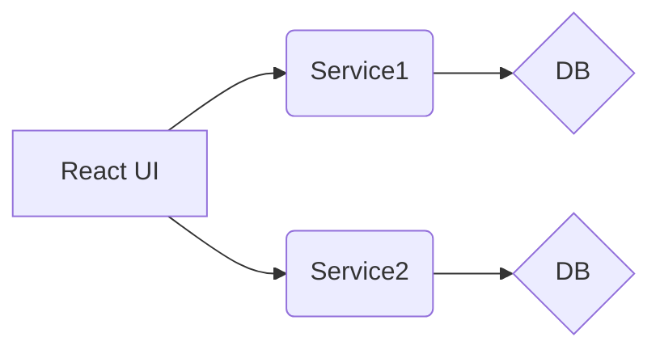

# post microservice

post microservice with spring boot,spring-data-jpa,java8 and Kotlin 1.6 .. WIP project.. 

# How to run :
mvn clean spring-boot:run -Dspring-boot.run.arguments="--test=test"

## diagrams

v0 current


v1 ..WIP/TBD later..
```mermaid
graph LR
A[React UI] --> B(Gateway)
B --> C(Service1)
B --> D(Service2)
C --> E{DB}
D --> F{DB}